# Algorithms-Tim-Sort

   
  
   
  
   
   
 

The Tim sort algorithm combines insertion sort as well as merge sort. For this reasoning, it is considered a hybrid sorting algorithm. The usefulness of this algorithm spans deeply across the coding industry, as this algorithm has been widely used in recent years. Python for example, uses this algorithm for the sorted() method, as well as the list.sort() method. In the process of picking this algorithm, I found it would be necessary to understand an algorithm that has such a practical use case in the real world. Seeing how many different languages alone incorporate this algorithm, I thought it would be fitting to chose and implement it.
## Project Goals

### Understand Tim Sort
This algorithm is strong in the fact that it handles real world data rather well. Understanding this allows the programmer to see the reasoning of picking such an algorithm, all while being enticed to explore the parts that make the algorithm unique. It is a hybrid sorting algorithm, as was already mentioned, and it also as stable algorithm. Using both insertion sort and merge sort, the goal of the algorithm is to try and limit the number swaps and comparisons that are needed. It takes an array and breaks it down into sub arrays, which can also be called runs. In order to for these sub arrays to run as efficiently as possible, there size should be around 32 to 64 for the optimal results. The sub arrays are then pieced back together with the upgraded merge sort algorithm. There are various different methods that can be used to piece the arrays back together, and these methods can get quite complex. To keep it simple the arrays are simply merged back together using the classic approach for this algorithm. Advanced methods include checking if the last index in one array is less then the intial index in the other array. This would indicate that each array can be merged together without the need of inserting each index one at a time.

#### Time Complexities
- Best Case Time Complexity is Ω(n)
- Average Case Time Complexity θ(n(log(n)))
- Worst Case Time Complexity is O(n(log(n)))

### Gain an Understanding in Algorithm Design & Implementation
- Picking an algorithm to solve a given problem is an easy task. Picking the __best__ algorithm to solve a required task takes knowledge and experience. The study of this algorithm highlights the areas that it is best at.
- There are plenty of ways to implement the same algorithm. Taking the time to plan it's implementation is important. This project had a planning phase, which allowed me to get a true understanding on the most effiecent way to implement this algorithm.

### Gain Experience in Performance Analysis & Benchmarking
- Testing is one of the most important skills a programmer can have. Anybody can test, but the key to a good tester is to have an open mind that anything can go wrong. By running this algorithm through rigorous amounts of testing, not only allows for most bugs to be handled, but also will show how it handles various amounts of inputs.
- The performance of this algorithm is important. Keeping note and testing the performance analysis will demonstrate the importance of this project. This is essentially explaining why choose this algorithm compared to others.
- With both benchmarking and performance analysis combined, a true understanding on the strengths of this algorithm are achieved.

### Gain Problem Solving & Critical Thinking Skills
- Coding is never easy, especially when doing something for the first time. This means there is bound to be bugs somewhere within an application. Thinking logically, and planning the creation of this algorithm out, gives great insight on how it is done in the real world.
- Taking the time to analyize an algorithm and understand which scenarios it would perform best in, is a strong skill to have. While in the testing phase, knowledge will be gained on which applications can utilize this algorithm to the best potential.

## Testing the Alogrithm
### Pytest
- Using poetry, which is a virtual environment handler in python, a pytest script is created to verify the accuracy of this algorithm.
- In order to understand the complexity and speed of this algorithm it is compared with merge sort, which is one of the most standard sorting algorithms.
- Testing includes generating inputs for both algorithms, and checking to make sure it actually sorted the list.
- __Image of the testing__ 
- The testing module can be found in the test directory. Simply run the command "poetry run pytest" while in the correct directory to verify.

## Performance of the Algorithm
### Testing Tim Sort
#### Input Size of 1000
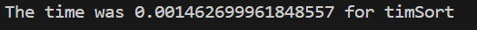

#### Input Size of 10000
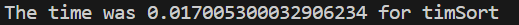

#### Input Size of 50000
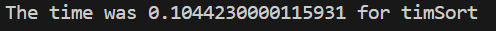

#### Input Size of 100000
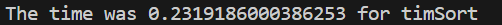

#### Input Size of 500000
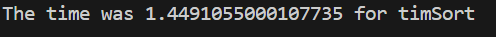

### Testing Merge Sort
#### Input Size of 1000 
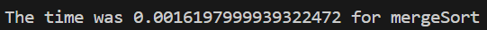

#### Input Size of 10000
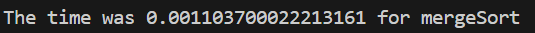

#### Input Size of 50000
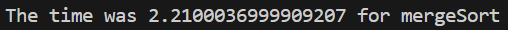

#### Input Size of 100000
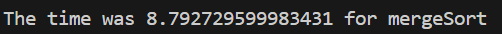

#### Input Size of 500000
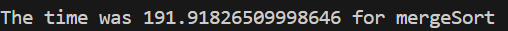

### Entire Program Output
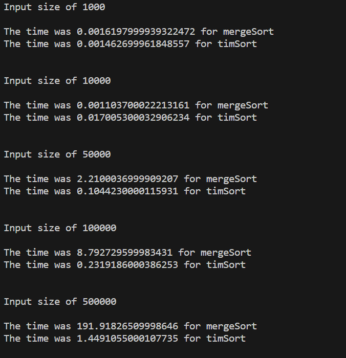

### Comparing the Algorithms
- Input size of 1000
  - The Tim sort algorithm ended up being 10.74% faster.
- Input size of 10000
  - The merge sort algorithm ended up being 1440.75% faster.
- Input size of 50000
  - The Tim sort algorithm ended up being 2016.39% faster.
- Input size of 100000
  - The Tim sort algorithm ended up being 3691.29% faster.
- Input size of 500000
  - The Tim sort algorithm ended up being 13143.91% faster.

### Discussing the Algorithms Time Complexity
In the case of Tim sort, from the test results, it is shown that it performs much better than merge sort in a majority of the test cases. This is due to the fact of how well this algorithm works with real world data. In the case of merge sort, it has to get every sub array to a base case of size 1 before it begins merging the arrays back together. The Tim sort algorithm does a fantastic job of making sure it does not have go that far down when spliting the sub arrays, and sections them into arrays of length 32 in the case of this application. This number should only be from 32 to 64 to get the most optimal results. In addition to this, merge sort also takes up more memory since there are more sub arrays that are generated. When the input size becomes very large, merge sort begins to fall behind Tim sort, due to the fact that Tim sort can once again handle real world data well. With a small input size, it is shown that the algorithms do not have a clear winner, and through multiple test runs, it was almost random which one ran better with a small input size. As soon as the input size was larger than 50000, it was apparent that the Tim sort algorithm was handling the data set much better. These test results were ran numerous times, and can also be tested by running the script in the src directory.

## Take Aways from this Application
As an algorithm engineer, which is the role assumed during this appicaition creation, it is important to understand each algorithm, in and out. This is because each algorithm has a specific use case, and the application that is using the algorithm should exploit this. This is the importance of understanding the space complexity as well as the time complexity of each algorithm. On paper each algorithm can say they run efficiently, but in the case of a real world application, how well can it hold up. This is questions that must be answered by skillful programmers, as they make educated decisions on what algorithm to implement into their applicaiton.
